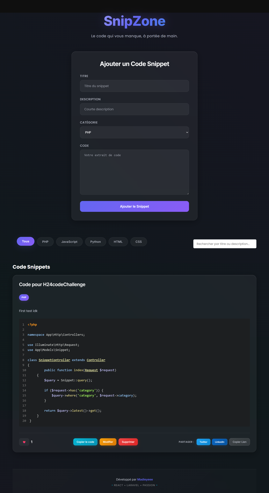

# 🌟 SnipZone

> **Le code qui vous manque, à portée de main.**

SnipZone est une plateforme moderne et élégante de partage d'extraits de code, développée avec React et Laravel. Conçue pour les développeurs qui souhaitent découvrir, partager et organiser facilement leurs snippets de code favoris.



## ✨ Fonctionnalités

### 🎯 **Fonctionnalités Principales**
- **📝 Gestion complète des snippets** - Créer, modifier, supprimer et consulter des extraits de code
- **🔍 Recherche intelligente** - Recherche par titre, description ou contenu
- **🏷️ Filtrage par catégorie** - Organisation par langages (PHP, HTML, CSS, JavaScript, Python, etc.)
- **📄 Pagination optimisée** - Navigation fluide à travers les collections
- **💾 Copie en un clic** - Copiez instantanément n'importe quel snippet

### 🚀 **Fonctionnalités Avancées**
- **❤️ Système de favoris** - Likez vos snippets préférés (protection anti-spam intégrée)
- **🔗 Partage social** - Partagez facilement sur Twitter, LinkedIn ou copiez le lien
- **🎨 Coloration syntaxique** - Mise en forme automatique du code avec Prism.js
- **📱 Design responsive** - Interface parfaitement adaptée mobile, tablette et desktop
- **🌙 Interface moderne** - Design "Nébuleuse de Code" avec effets glassmorphism

### 🎪 **Expérience Utilisateur**
- **🔔 Notifications toast** - Retours visuels élégants pour toutes les actions
- **⚡ Animations fluides** - Micro-interactions et transitions soignées
- **🎭 Effets visuels** - Gradient animé, glassmorphism, et effets de profondeur
- **♿ Accessibilité** - Interface intuitive et navigation optimisée

## 🛠️ Technologies Utilisées

### **Frontend**
- **React 18** - Bibliothèque UI moderne
- **React Router** - Navigation SPA
- **Axios** - Client HTTP
- **React Toastify** - Notifications élégantes
- **React Syntax Highlighter** - Coloration syntaxique
- **CSS3** - Animations et glassmorphism

### **Backend**
- **Laravel 10** - Framework PHP robuste
- **SQLite** - Base de données légère
- **API RESTful** - Architecture moderne

### **Design & UX**
- **Glassmorphism** - Effets de transparence et flou
- **Gradient animé** - Arrière-plan dynamique
- **Responsive Design** - Mobile-first approach
- **Typography moderne** - Fonts Inter & Poppins

## 🚀 Installation

### **Prérequis**
- PHP 8.1+
- Composer
- Node.js 16+
- npm ou yarn

### **Backend (Laravel)**
```bash
# Cloner le repository
git clone https://github.com/Madieyeee/SnipZone.git
cd SnipZone

# Installer les dépendances PHP
composer install

# Configuration de l'environnement
cp .env.example .env
php artisan key:generate

# Base de données
php artisan migrate
php artisan db:seed

# Lancer le serveur
php artisan serve
```

### **Frontend (React)**
```bash
# Aller dans le dossier frontend
cd frontend

# Installer les dépendances
npm install

# Lancer l'application
npm start
```

L'application sera accessible sur `http://localhost:3000`

## 📁 Structure du Projet

```
SnipZone/
├── 📂 backend/              # API Laravel
│   ├── 📂 app/Http/Controllers/
│   ├── 📂 database/migrations/
│   └── 📂 routes/
├── 📂 frontend/             # Application React
│   ├── 📂 src/
│   │   ├── 📂 components/   # Composants réutilisables
│   │   ├── 📂 pages/        # Pages principales
│   │   └── 📂 styles/       # Styles CSS
│   └── 📂 public/
└── 📄 README.md
```

## 🤝 Contribution

Les contributions sont les bienvenues ! N'hésitez pas à :

1. **Fork** le projet
2. **Créer** une branche pour votre fonctionnalité
3. **Commit** vos changements
4. **Push** vers la branche
5. **Ouvrir** une Pull Request

## 📄 Licence

Ce projet est sous licence MIT.
## 👨‍💻 Développeur

**Développé par [Madieyeee](https://github.com/Madieyeee)**

Passionné de développement web, spécialisé dans les technologies React et Laravel. Toujours à la recherche de nouveaux défis et d'innovations techniques.

---

<div align="center">

**⭐ Si ce projet vous plaît, n'hésitez pas à lui donner une étoile !**

[🌟 Star ce repo](https://github.com/Madieyeee/SnipZone) • [🐛 Reporter un bug](https://github.com/Madieyeee/SnipZone/issues) • [💡 Suggérer une fonctionnalité](https://github.com/Madieyeee/SnipZone/issues)

</div>
